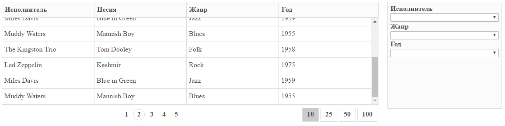

# AngularJs ExpressJs


* run mongodb
* build client 
* run server


```bash
$ (cd ./client && npm install) && (cd ./server && npm install) && (cd ./client && npm run build) && (cd ./server && npm start)
```


### via docker
```bash
$ docker-compose up -d
```

